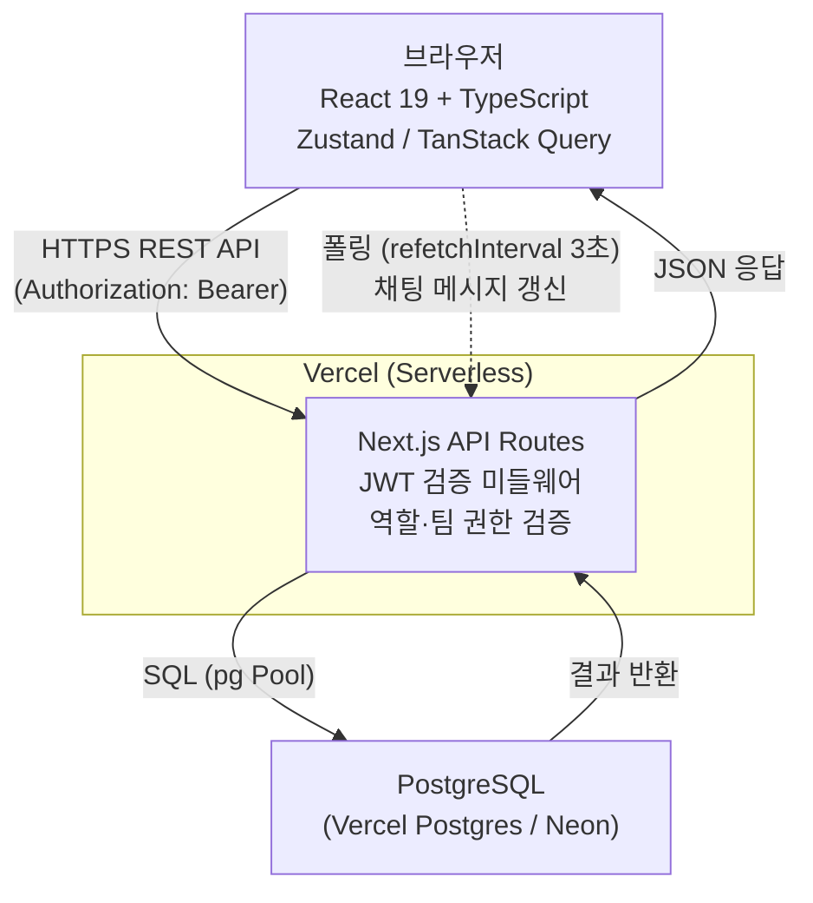
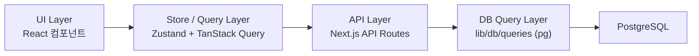
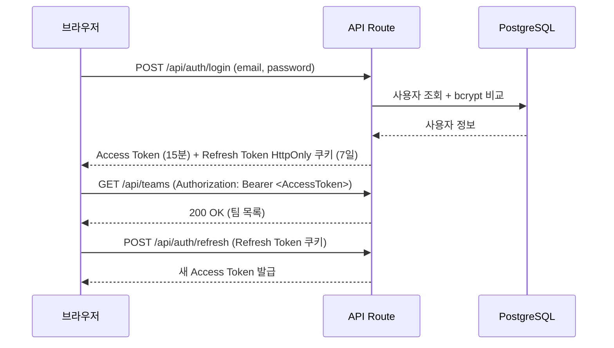
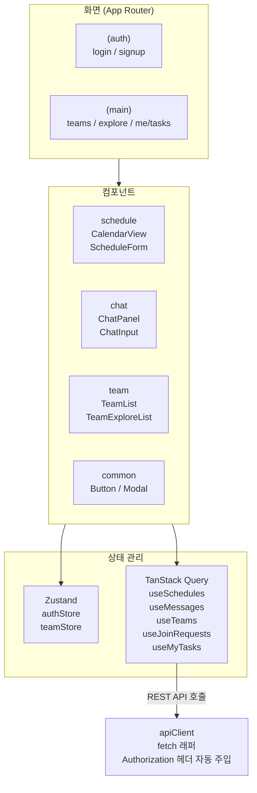
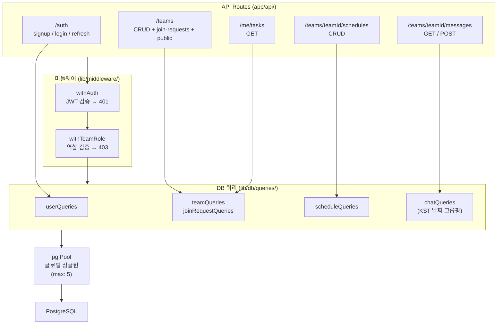

# Team CalTalk — 기술 아키텍처 다이어그램

## 문서 이력

| 버전 | 날짜 | 변경 내용 |
|------|------|-----------|
| 1.0 | 2026-04-07 | 최초 작성 |
| 1.1 | 2026-04-08 | TeamInvitation → TeamJoinRequest 반영: 다이어그램 4, 5에서 invitations 관련 경로·쿼리 제거, join-requests 반영 |

---

## 다이어그램 1 — 전체 시스템 아키텍처

---

## 다이어그램 2 — 레이어 의존성

---

## 다이어그램 3 — 인증 흐름

---

## 다이어그램 4 — 프론트엔드 아키텍처

---

## 다이어그램 5 — 백엔드 아키텍처

---

## Vercel 제약 요약

- WebSocket / SSE 미지원 — 채팅은 TanStack Query `refetchInterval: 3000` 폴링으로 대체
- Serverless Function 실행 시간 기본 10초 제한 — 복잡한 집계 쿼리 금지, 인덱스 필수
- 로컬 파일 쓰기 불가, DB 연결은 pg Pool 글로벌 싱글턴(max: 5)으로 과부하 방지
