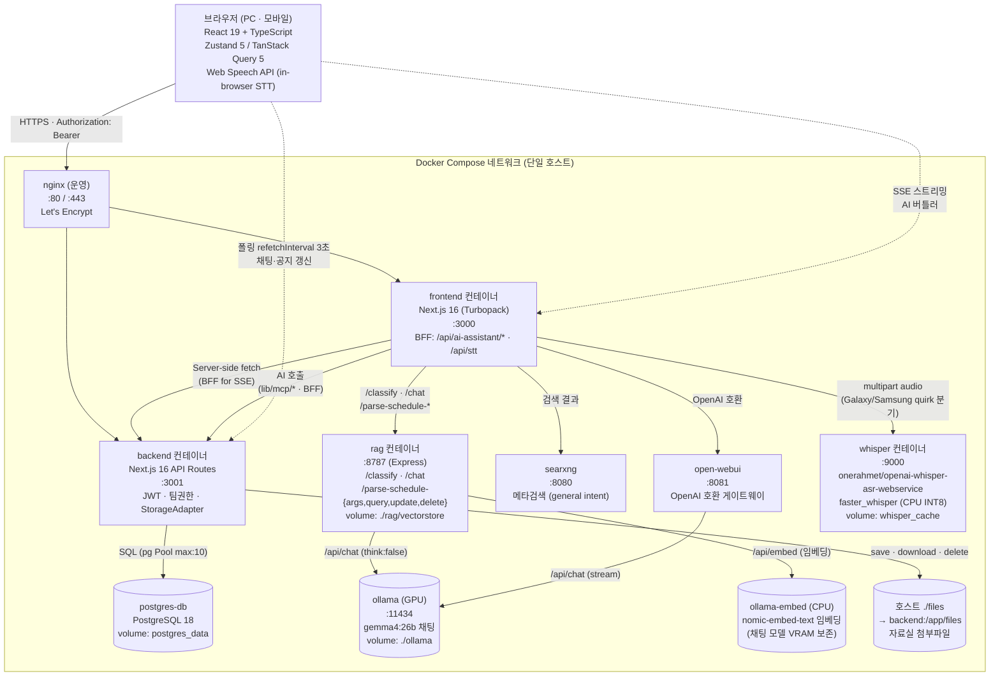
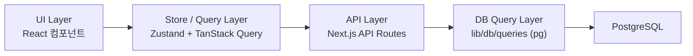
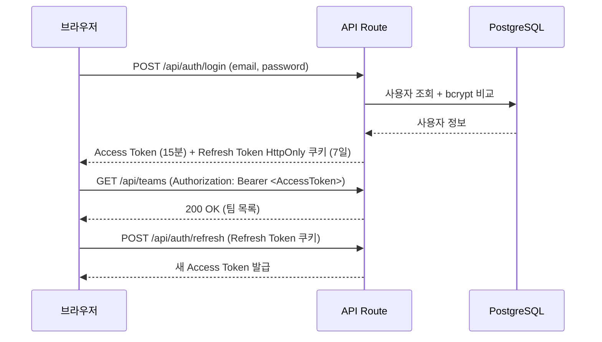
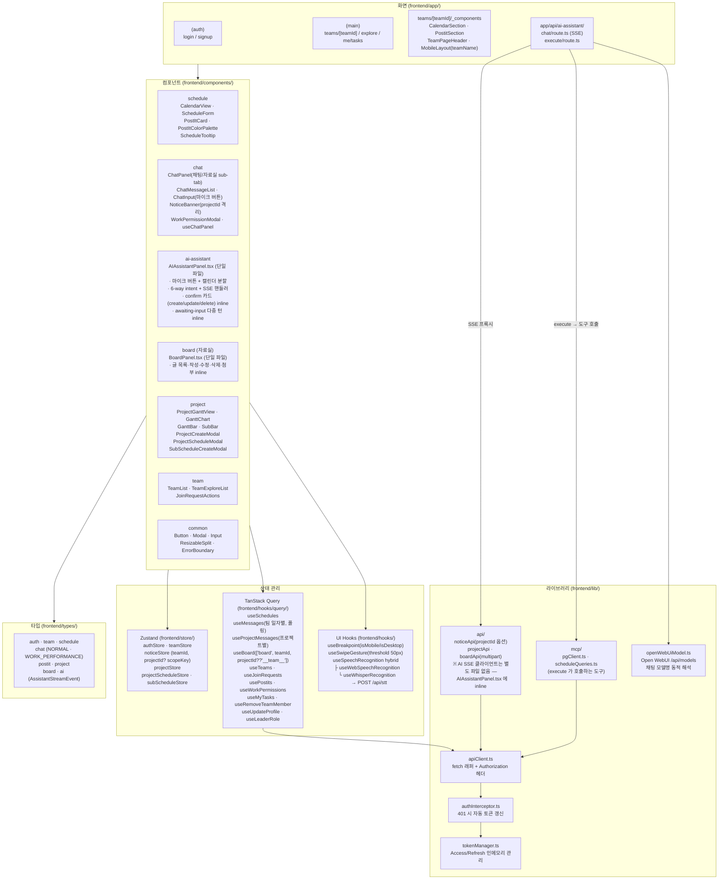
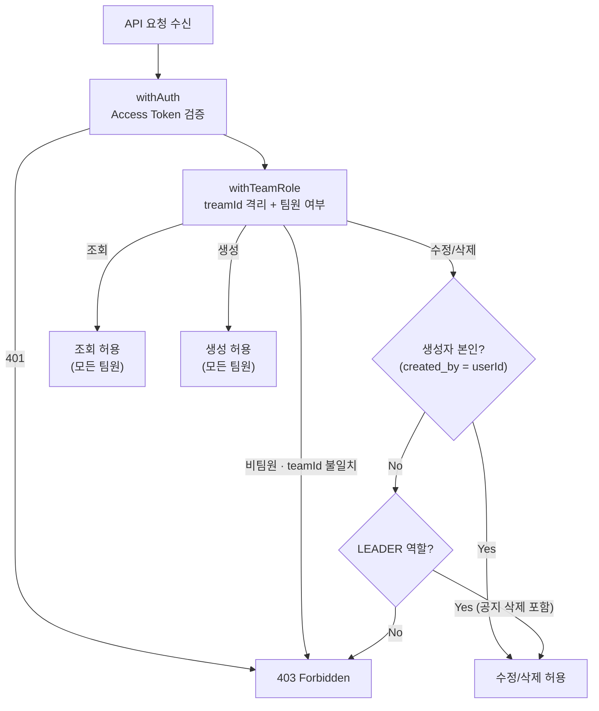
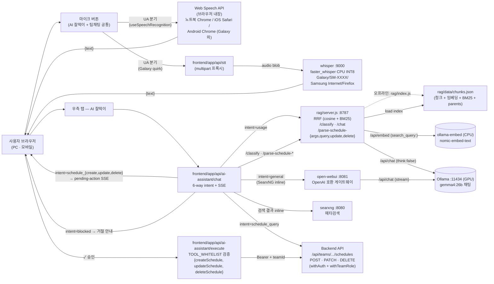

# TEAM WORKS — 기술 아키텍처 다이어그램

## 문서 이력

| 버전 | 날짜 | 변경 내용 |
|------|------|-----------|
| 1.0 | 2026-04-07 | 최초 작성 |
| 1.1 | 2026-04-08 | TeamInvitation → TeamJoinRequest 반영: 다이어그램 4, 5에서 invitations 관련 경로·쿼리 제거, join-requests 반영 |
| 1.2 | 2026-04-09 | 디렉토리 구조 개편 반영: 다이어그램 4, 5 경로를 frontend/ · backend/ 기준으로 갱신 |
| 1.3 | 2026-04-20 | 앱명 Team CalTalk → TEAM WORKS 반영. 신규 기능(포스트잇/공지사항/업무보고 권한/프로젝트 관리) 전체 반영: 다이어그램 4(프론트엔드 컴포넌트·스토어·훅), 다이어그램 5(백엔드 Routes·Queries) 전면 갱신. 다이어그램 6(권한 흐름) 신규 추가 |
| 1.4 | 2026-04-28 | 다이어그램 7(AI 비서 흐름 — RAG·Agent·MCP·Ollama, gemma4:26b) 신규 추가 |
| 1.5 | 2026-04-29 | docs/4 v1.9 동기화 — Vercel 가정 폐기 → Docker Compose 단일 호스트 운영. 다이어그램 1 재작성(컨테이너 토폴로지). 다이어그램 4 갱신(ai-assistant/board 컴포넌트, useBoard/useProjectMessages 훅, boardApi/aiAssistantApi, types/board·ai, lib/sse). 다이어그램 5 갱신(board·files·project messages/notices 라우트, boardQueries, lib/files StorageAdapter, lib/ai 4-way 분기). 다이어그램 7 파일 경로 갱신(`backend/lib/ai/`). pg Pool max 5→10 |
| 1.6 | 2026-05-12 | docs/1 v2.1·docs/2 v1.7·docs/4 v1.10 동기화. **다이어그램 1** — Whisper STT 컨테이너 추가(:9000, `faster_whisper`, `whisper_cache` volume), Ollama 임베딩 CPU 분리(`ollama-embed`) 표기. **다이어그램 4** — STT hook trio(`useSpeechRecognition` hybrid · `useWebSpeechRecognition` · `useWhisperRecognition`) + `useSwipeGesture` 추가. AI Assistant 컴포넌트가 마이크 버튼 보유. **다이어그램 5** — AI 로직 위치 정정: `backend/lib/ai/` 폐기, 실제는 `frontend/lib/mcp/` + `frontend/app/api/{ai-assistant,stt}/`. 4-way → 6-way 분류. **다이어그램 7** — 6-way intent + `schedule_update`/`schedule_delete` confirm 흐름, STT 분기 추가(Web Speech 직접 ↔ Whisper backend 분기). |
| 1.7 | 2026-05-12 | Ghost file 정정 (docs/4 v1.11 동기) — 다이어그램 4 의 `AIAssistantPanel` 노드가 ConfirmCard·AwaitingInputForm 을 inline 으로 가짐을 명시. `BoardPanel` 도 단일 파일임을 명시. `aiAssistantApi` 노드 제거(미존재), `frontend/lib/mcp/` + `openWebUiModel.ts` 노드 추가. |

---

## 다이어그램 1 — 전체 시스템 아키텍처 (Docker Compose 단일 호스트)

> 모든 서비스 간 통신은 docker-compose 네트워크 명(`postgres-db`, `ollama`, `ollama-embed`, `rag`, `searxng`, `open-webui`, `whisper`)으로 라우팅. 자세한 운영 절차는 `docs/19-deploy-guide.md` / `docs/20-easy-deploy.md` 참고. AI 흐름 상세는 **다이어그램 7**, STT 상세는 `docs/22-voice-input.md`.

---

## 다이어그램 2 — 레이어 의존성

---

## 다이어그램 3 — 인증 흐름

---

## 다이어그램 4 — 프론트엔드 아키텍처

---

## 다이어그램 5 — 백엔드 아키텍처

```mermaid
graph TB
    subgraph Routes["API Routes (backend/app/api/)"]
        AuthR["/auth\nsignup · login · refresh · me"]
        TeamR["/teams\nCRUD · join-requests · public\nmembers(강퇴)"]
        SchedR["/teams/teamId/schedules\nCRUD"]
        PostitR["/teams/teamId/postits\nCRUD"]
        ChatR["/teams/teamId/messages\n(팀 일자별)\nGET · POST"]
        NoticeR["/teams/teamId/notices\n(팀 일자별)\nGET · POST · DELETE"]
        BoardR["/teams/teamId/board\n?projectId= 분기\nGET · POST(multipart)\nPATCH(작성자) · DELETE(작성자)"]
        FileR["/files/[fileId]\nLocal: stream · S3: 302\n팀 멤버십 검증"]
        WorkPermR["/teams/teamId/work-permissions\nGET · PATCH"]
        ProjectR["/teams/teamId/projects\nCRUD"]
        PMsgR["/projects/projectId/messages\n(프로젝트별 격리)"]
        PNotR["/projects/projectId/notices\n(프로젝트별 격리)"]
        PSR["/projects/projectId/schedules\nCRUD"]
        SubR["/schedules/scheduleId/sub-schedules\nCRUD"]
        TasksR["/me/tasks\nGET"]
    end

    subgraph Middleware["미들웨어 (backend/lib/middleware/)"]
        WithAuth["withAuth\nJWT 검증 → 401"]
        WithRole["withTeamRole\n역할 검증 → 403"]
    end

    subgraph Queries["DB 쿼리 (backend/lib/db/queries/)"]
        UQ["userQueries"]
        TMQ["teamQueries · joinRequestQueries"]
        SQ["scheduleQueries"]
        CQ["chatQueries\n(KST + projectId? 격리)"]
        PsQ["postitQueries"]
        NQ["noticeQueries\n(projectId? 격리)"]
        BQ["boardQueries\nposts + attachments"]
        WPQ["permissionQueries"]
        PrQ["projectQueries\nprojectScheduleQueries\nsubScheduleQueries"]
    end

    subgraph Files["lib/files (StorageAdapter)"]
        Storage["storage.ts\nStorageAdapter 인터페이스\ncreateStorageAdapter()\n(STORAGE_BACKEND env)"]
        Local["localStorage.ts\nhost ./files mount\nUUID 파일명"]
        S3["s3Storage.ts\n운영 전환 시 구현\n(presigned URL)"]
        Validate["validate.ts\nMIME 화이트리스트\nmagic-bytes\n10MB cap"]
    end

    subgraph AI["AI 버틀러 (frontend BFF)"]
        BFFChat["frontend/app/api/ai-assistant/chat/route.ts\n6-way intent + SSE 분기"]
        BFFExec["frontend/app/api/ai-assistant/execute/route.ts\nTOOL_WHITELIST 검증 후\nbackend Schedule CRUD 호출"]
        BFFStt["frontend/app/api/stt/route.ts\nmultipart audio → Whisper :9000"]
        MCPQ["frontend/lib/mcp/scheduleQueries.ts\n자연어 → schedule_query 변환"]
        MCPPg["frontend/lib/mcp/pgClient.ts\n(READ-ONLY 가드 보조 — 실 권한은 backend 미들웨어)"]
    end

    Pool["pg Pool\n글로벌 싱글턴\n(backend/lib/db/pool.ts, max: 10)"]
    DB["PostgreSQL 18\n(postgres-db 컨테이너)"]
    HostFiles[("호스트 ./files\n(volume mount)")]
    OllamaSvc[("ollama 컨테이너\n:11434")]
    RAGSvc[("rag 컨테이너 :8787")]
    SearXSvc[("searxng 컨테이너 :8080")]

    Routes --> WithAuth --> WithRole
    WithRole --> Queries
    AuthR --> UQ
    TeamR --> TMQ
    SchedR --> SQ
    PostitR --> PsQ
    ChatR --> CQ
    NoticeR --> NQ
    BoardR --> BQ
    BoardR --> Files
    FileR --> BQ
    FileR --> Files
    WorkPermR --> WPQ
    ProjectR --> PrQ
    PMsgR --> CQ
    PNotR --> NQ
    PSR --> PrQ
    SubR --> PrQ
    TasksR --> TMQ
    Queries --> Pool --> DB

    Storage --> Local
    Storage --> S3
    Local --> HostFiles
    Files --> Validate

    AI -. "/classify · /chat\n/parse-schedule-*" .-> RAGSvc
    AI -. "검색" .-> SearXSvc
    AI -. "OpenAI 호환" .-> OllamaSvc
    BFFExec -. "Bearer + teamId 격리" .-> SchedR
    BFFExec -. "PATCH/DELETE" .-> SchedR
    BFFStt -. "multipart audio" .-> WhisperSvc[("whisper :9000")]
```

---

## 다이어그램 6 — 권한 흐름 (Creator-based + LEADER 특권)

---

## 다이어그램 7 — AI 비서 흐름 (6-way intent + STT)

팀 페이지 우측 sub-탭 [AI 찰떡이] 의 단일 입력창에서 자연어 또는 음성으로 요청한다. frontend BFF (`frontend/app/api/ai-assistant/chat/route.ts`) 가 RAG `/classify` 결과의 6-way intent 에 따라 분기한다. 음성 입력(STT) 은 디바이스 quirk 에 따라 브라우저 내장 Web Speech 또는 Whisper 컨테이너로 자동 분기된다.

흐름 핵심:
- **단일 진입점** — 모드 토글 없이 사용자 자연어를 RAG `/classify` 가 6-way 로 분류 (`usage` / `general` / `schedule_query` / `schedule_create` / `schedule_update` / `schedule_delete` / `blocked`). 자세한 설계는 `docs/16-mcp-server-plan.md`.
- **음성 입력(STT)** — 마이크 버튼 클릭 시 `useSpeechRecognition` hybrid hook 이 UA 검사로 자동 분기. Web Speech 분기는 브라우저 내부에서 변환 → 텍스트만 입력창에 채워짐 (서버 호출 없음). Whisper 분기는 `MediaRecorder` 로 녹음 → `/api/stt` → Whisper 컨테이너. 오디오는 DB 영구 저장 없음. 자세한 흐름은 `docs/22-voice-input.md`.
- **사용법(`usage`)** — `ollama/*.md` 공식 문서를 RAG 로 검색해 답변.
- **일반 질문(`general`)** — frontend 가 SearxNG 직접 호출해 결과를 system prompt 에 inline 주입, Open WebUI 모델이 답변 생성 (web_search 비활성).
- **일정 조회(`schedule_query`)** — `frontend/lib/mcp/scheduleQueries.ts` 가 자연어를 view+date+keyword 로 변환 후 backend Schedule API 직접 호출. 코드가 한국어로 즉시 포맷.
- **일정 등록·수정·삭제(`schedule_create/update/delete`)** — `pending-action` SSE 로 confirm 카드 → 사용자 ✓ 클릭 → `/api/ai-assistant/execute` → TOOL_WHITELIST 검증 후 backend POST/PATCH/DELETE. `created_by`/생성자 검증은 backend `withAuth`/`withTeamRole` 미들웨어. 정보 부족 시 `awaiting-input` 으로 다중 턴.
- **거절(`blocked`)** — 일정 외 도메인(프로젝트·채팅·공지·포스트잇·자료실) 요청은 정중한 안내. (일정 수정·삭제는 더 이상 blocked 아님 — schedule_update/delete 로 지원)
- **임베딩 CPU 분리** — `ollama-embed` 컨테이너에서 `nomic-embed-text` 만 돌려 채팅 모델(GPU) VRAM 점유 최소화. 자세한 운영은 `docs/embeding-cpu.md`.
- **호출 옵션** — `rag/ollamaClient.js` 의 `DEFAULT_CHAT_OPTIONS = { num_ctx: 32768, num_predict: 1024 }` + `think: false` (gemma4:26b thinking-mode 비활성).
- **인덱스 산출물** — `rag/data/chunks.json` 은 `rag/index.js` 가 1회 생성. `ollama/*.md` 가 변경되면 재인덱싱 후 RAG 서버 재기동 필요(`docs/13-RAG-pipeline-guide.md §6.3·§6.4`).

---

## 배포 환경 — Docker Compose 단일 호스트

`docker-compose.yml` 단일 파일로 모든 서비스 컨테이너화 — **postgres-db / backend / frontend / nginx / ollama / rag / searxng / open-webui**. Vercel 가정은 폐기됨 (docs/4 v1.9 갱신).

- **채팅 갱신** — TanStack Query `refetchInterval: 3000` 폴링. AI 버틀러는 SSE 스트리밍 (long-lived 연결 가능)
- **요청 시간 제약** — 없음. nginx `proxy_read_timeout 600s` 로 AI 추론 long-tail 흡수
- **파일 시스템 쓰기** — 자료실 첨부파일은 호스트 `./files:/app/files` mount. 운영 클라우드 전환 시 `STORAGE_BACKEND=s3` 토글만으로 swap (`docs/18-board-guide.md` §6, 호출처 코드 0건 변경)
- **DB 연결** — pg Pool 글로벌 싱글턴(max: 10). 컨테이너 네트워크 안에서 `postgres-db:5432` 직결. 멀티 backend 인스턴스 시 PgBouncer 권장
- **AI 인프라** — Ollama 모델 캐시는 `./ollama:/root/.ollama` 호스트 mount 로 영속화. RAG vectorstore 는 `./rag/vectorstore` 에 저장. 첫 부팅 시 `ollama pull gemma4:26b` + `ollama pull nomic-embed-text` 자동 실행
- **임베딩 모델 CPU 분리** — `ollama-embed` 별도 컨테이너로 분리해 채팅 모델(GPU) VRAM 보존. `nomic-embed-text` 만 적재 (`docs/embeding-cpu.md`)
- **음성 입력(STT) 인프라** — `whisper` 컨테이너(`onerahmet/openai-whisper-asr-webservice:latest`, `faster_whisper`, CPU INT8 default). `whisper_cache` volume 으로 모델 캐시 영속. env `WHISPER_MODEL`(small/medium/large-v3-turbo), `WHISPER_ENGINE`. HF xet storage TLS 회피 (`HF_HUB_DISABLE_XET=1`)
- **운영 절차 / GPU 사양 / 백업 정책** — `docs/19-deploy-guide.md`, `docs/20-easy-deploy.md`(STT 챕터 포함) 참고
