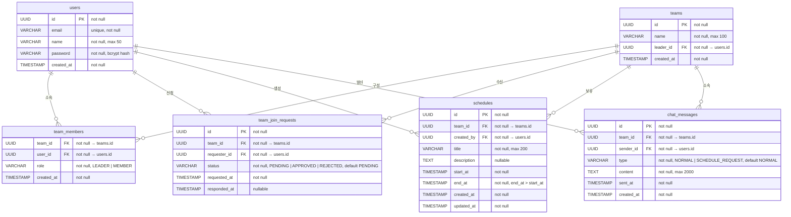

# Team CalTalk — ERD (Entity Relationship Diagram)

## 문서 이력

| 버전 | 날짜 | 변경 내용 |
|------|------|-----------|
| 1.0 | 2026-04-07 | 최초 작성 |
| 1.1 | 2026-04-08 | team_invitations 테이블 제거 → team_join_requests 테이블 추가. 관련 제약조건·인덱스·외래키 정보 갱신 |

---

## 1. ERD 다이어그램

---

## 2. 테이블 상세 설명

### 2.1 users (사용자)

팀 서비스의 모든 인증 주체를 저장합니다. 이메일 기반 가입·로그인을 사용하며 비밀번호는 bcrypt로 해싱하여 저장합니다.

| 컬럼 | 타입 | 제약 | 설명 |
|------|------|------|------|
| id | UUID | PK, NOT NULL | 사용자 고유 식별자 (gen_random_uuid()) |
| email | VARCHAR(255) | UNIQUE, NOT NULL | 로그인 ID. 이메일 형식 검증 필수 |
| name | VARCHAR(50) | NOT NULL | 표시 이름, 최대 50자 |
| password | VARCHAR(255) | NOT NULL | bcrypt 해시값 (saltRounds: 12) |
| created_at | TIMESTAMP | NOT NULL, DEFAULT now() | 가입 일시 (UTC 저장) |

**인덱스 권장사항**
- `CREATE UNIQUE INDEX idx_users_email ON users(email);` — 이메일 중복 검증 및 로그인 조회 성능

---

### 2.2 teams (팀)

팀 단위 일정·채팅의 최상위 컨텍스트입니다. `leader_id`가 팀장 권한의 단일 진실 원천(source of truth)입니다.

| 컬럼 | 타입 | 제약 | 설명 |
|------|------|------|------|
| id | UUID | PK, NOT NULL | 팀 고유 식별자 |
| name | VARCHAR(100) | NOT NULL | 팀 이름, 최대 100자 |
| leader_id | UUID | FK → users.id, NOT NULL | 현재 팀장. 팀장 변경 시 team_members.role 동시 갱신 필요 |
| created_at | TIMESTAMP | NOT NULL, DEFAULT now() | 팀 생성 일시 (UTC 저장) |

**인덱스 권장사항**
- `CREATE INDEX idx_teams_leader_id ON teams(leader_id);` — 팀장 기준 팀 조회

---

### 2.3 team_members (팀 구성원)

`users`와 `teams`의 다대다 연결 테이블입니다. `(team_id, user_id)` 복합 PK로 중복 가입을 방지합니다.

| 컬럼 | 타입 | 제약 | 설명 |
|------|------|------|------|
| team_id | UUID | FK → teams.id, NOT NULL | 소속 팀 |
| user_id | UUID | FK → users.id, NOT NULL | 구성원 사용자 |
| role | VARCHAR(20) | NOT NULL | 역할: `LEADER` 또는 `MEMBER` |
| created_at | TIMESTAMP | NOT NULL, DEFAULT now() | 팀 가입 일시 (UTC 저장) |

> **복합 PK:** `PRIMARY KEY (team_id, user_id)`

**인덱스 권장사항**
- `CREATE INDEX idx_team_members_user_id ON team_members(user_id);` — 사용자가 속한 팀 목록 조회
- `CREATE INDEX idx_team_members_team_id ON team_members(team_id);` — 팀 구성원 목록 조회

---

### 2.4 team_join_requests (팀 가입 신청)

로그인한 사용자가 원하는 팀에 가입 신청을 제출하면 생성되는 레코드입니다. 팀장이 승인(APPROVE)하면 `team_members`에 MEMBER로 원자적 등록되고 `status`가 APPROVED로 갱신됩니다. 거절(REJECT) 시 `status`만 REJECTED로 갱신되며 팀 합류는 발생하지 않습니다.

| 컬럼 | 타입 | 제약 | 설명 |
|------|------|------|------|
| id | UUID | PK, NOT NULL | 가입 신청 고유 식별자 |
| team_id | UUID | FK → teams.id, NOT NULL | 가입을 신청한 대상 팀 |
| requester_id | UUID | FK → users.id, NOT NULL | 가입을 신청한 사용자 |
| status | VARCHAR(20) | NOT NULL, DEFAULT 'PENDING' | 상태: `PENDING` \| `APPROVED` \| `REJECTED` |
| requested_at | TIMESTAMP | NOT NULL | 가입 신청 일시 (UTC 저장) |
| responded_at | TIMESTAMP | NULL | 팀장이 승인/거절한 일시 (UTC 저장). 미처리 시 NULL |

**인덱스 권장사항**
- `CREATE INDEX idx_team_join_requests_team_id_status ON team_join_requests(team_id, status);` — 팀별 PENDING 신청 조회 및 나의 할 일 목록 피드
- `CREATE INDEX idx_team_join_requests_requester_id ON team_join_requests(requester_id);` — 특정 사용자의 신청 이력 조회 및 중복 신청 방지 검증

---

### 2.5 schedules (팀 일정)

팀장(LEADER)만 생성·수정·삭제할 수 있는 팀 단위 일정입니다. `start_at < end_at` 제약은 DB CHECK 또는 애플리케이션 레이어에서 강제합니다.

| 컬럼 | 타입 | 제약 | 설명 |
|------|------|------|------|
| id | UUID | PK, NOT NULL | 일정 고유 식별자 |
| team_id | UUID | FK → teams.id, NOT NULL | 소속 팀 |
| created_by | UUID | FK → users.id, NOT NULL | 일정을 생성한 팀장 |
| title | VARCHAR(200) | NOT NULL | 일정 제목, 최대 200자 |
| description | TEXT | NULL | 일정 상세 설명, 선택 입력 |
| start_at | TIMESTAMP | NOT NULL | 일정 시작 일시 (UTC 저장) |
| end_at | TIMESTAMP | NOT NULL | 일정 종료 일시 (UTC 저장), end_at > start_at |
| created_at | TIMESTAMP | NOT NULL, DEFAULT now() | 레코드 생성 일시 (UTC 저장) |
| updated_at | TIMESTAMP | NOT NULL, DEFAULT now() | 최종 수정 일시 (UTC 저장) |

**인덱스 권장사항**
- `CREATE INDEX idx_schedules_team_id_start_at ON schedules(team_id, start_at);` — 팀의 기간별 일정 조회 (월/주/일 뷰)
- `CREATE INDEX idx_schedules_team_id_end_at ON schedules(team_id, end_at);` — 기간 범위 쿼리 보조

---

### 2.6 chat_messages (채팅 메시지)

팀 내 채팅 기록을 저장합니다. 메시지는 수정·삭제가 불가하므로 `updated_at`은 포함하지 않습니다. `sent_at` 기준 KST 날짜로 그룹핑하여 날짜별 조회를 지원합니다.

| 컬럼 | 타입 | 제약 | 설명 |
|------|------|------|------|
| id | UUID | PK, NOT NULL | 메시지 고유 식별자 |
| team_id | UUID | FK → teams.id, NOT NULL | 소속 팀 |
| sender_id | UUID | FK → users.id, NOT NULL | 메시지 발신자 |
| type | VARCHAR(30) | NOT NULL, DEFAULT 'NORMAL' | 메시지 유형: `NORMAL` \| `SCHEDULE_REQUEST` |
| content | TEXT | NOT NULL | 메시지 본문, 최대 2000자 |
| sent_at | TIMESTAMP | NOT NULL | 전송 일시 (UTC 저장, KST 변환으로 날짜 그룹핑) |
| created_at | TIMESTAMP | NOT NULL, DEFAULT now() | 레코드 생성 일시 |

**인덱스 권장사항**
- `CREATE INDEX idx_chat_messages_team_id_sent_at ON chat_messages(team_id, sent_at DESC);` — 팀의 날짜별 메시지 조회 (가장 빈번한 쿼리 패턴)
- `CREATE INDEX idx_chat_messages_sender_id ON chat_messages(sender_id);` — 발신자 기준 메시지 조회 (선택적)

---

## 3. 주요 제약조건 정리

### 3.1 유니크 제약

| 테이블 | 컬럼 | 설명 |
|--------|------|------|
| users | email | 이메일 중복 가입 방지 |
| team_members | (team_id, user_id) | 동일 팀에 동일 사용자 중복 등록 방지 |

### 3.2 CHECK 제약

| 테이블 | 제약 조건 | 설명 |
|--------|-----------|------|
| schedules | end_at > start_at | 일정 종료 시각은 시작 시각 이후여야 함 |
| team_members | role IN ('LEADER', 'MEMBER') | 허용된 역할 값만 저장 |
| team_join_requests | status IN ('PENDING', 'APPROVED', 'REJECTED') | 허용된 상태 값만 저장 |
| chat_messages | type IN ('NORMAL', 'SCHEDULE_REQUEST') | 허용된 메시지 유형만 저장 |

### 3.3 외래키 제약

| 테이블 | 컬럼 | 참조 | ON DELETE |
|--------|------|------|-----------|
| teams | leader_id | users.id | RESTRICT |
| team_members | team_id | teams.id | CASCADE |
| team_members | user_id | users.id | CASCADE |
| team_join_requests | team_id | teams.id | CASCADE |
| team_join_requests | requester_id | users.id | RESTRICT |
| schedules | team_id | teams.id | CASCADE |
| schedules | created_by | users.id | RESTRICT |
| chat_messages | team_id | teams.id | CASCADE |
| chat_messages | sender_id | users.id | RESTRICT |

### 3.4 비즈니스 규칙 기반 제약 (애플리케이션 레이어)

| 규칙 ID | 내용 | 적용 위치 |
|---------|------|-----------|
| BR-02 | 일정 생성·수정·삭제는 LEADER만 가능 | withTeamRole 미들웨어 |
| BR-03 | 가입 신청 승인·거절은 LEADER만 가능. 승인 시 team_members 원자적 등록 | API Route 권한 검증 |
| BR-05 | 채팅 메시지는 sent_at 기준 KST 날짜로 그룹핑 조회 | chatQueries.ts (UTC→KST 변환) |
| BR-06 | 일정·채팅은 team_id 기반 격리, 타 팀 데이터 접근 불가 | 모든 쿼리에 team_id WHERE 조건 필수 |
| BR-07 | 동일 팀에 PENDING 신청이 이미 존재하거나 이미 구성원인 경우 가입 신청 불가 | JOIN REQUEST API 중복 검증 로직 |

---

## 4. 관련 문서

| 문서 | 경로 |
|------|------|
| 도메인 정의서 | docs/1-domain-definition.md |
| PRD | docs/2-prd.md |
| 유저 시나리오 | docs/3-user-scenarios.md |
| API 명세 | docs/7-api-spec.md |
