# TEAM WORKS — ERD (Entity Relationship Diagram)

## 문서 이력

| 버전 | 날짜 | 변경 내용 |
|------|------|-----------|
| 1.0 | 2026-04-07 | 최초 작성 |
| 1.1 | 2026-04-08 | team_invitations 테이블 제거 → team_join_requests 테이블 추가. 관련 제약조건·인덱스·외래키 정보 갱신 |
| 1.2 | 2026-04-08 | users.password 컬럼명 → password_hash 로 수정 (schema.sql 실제 구현 반영). teams 인덱스 권장사항에 idx_teams_leader_id 추가 |
| 1.3 | 2026-04-18 | 앱명 Team CalTalk → TEAM WORKS 반영. chat_messages.type 값 SCHEDULE_REQUEST → WORK_PERFORMANCE 변경 (실제 구현 반영). work_performance_permissions 테이블 추가 |
| 1.4 | 2026-04-19 | postits, projects, project_schedules, sub_schedules, notices 테이블 추가 (DB 영구저장 구현 반영) |
| 1.5 | 2026-04-29 | 자료실(board)·프로젝트 채팅/공지 격리 반영 — chat_messages·notices 에 project_id 컬럼 추가(NULL=팀 일자별, NOT NULL=프로젝트 격리), board_posts·board_attachments 테이블 신규, 관련 인덱스(partial WHERE project_id NOT NULL)·CHECK·FK ON DELETE 매트릭스 갱신, BR-08~11 추가(자료실 작성자 권한·첨부 검증·격리·다운로드 멤버십 검증). §3.2 누락 CHECK(chk_schedules_color, chk_chat_messages_type) 보강 |
| 1.6 | 2026-05-12 | docs/1 v2.1·docs/2 v1.7 동기화: **스키마 변경 없음 — 신기능 모두 기존 테이블 재사용**. AI 4-way → 6-way 분류(`schedule_update`/`schedule_delete` 추가) 는 기존 `schedules` 테이블 UPDATE/DELETE 로 처리(created_by 검증). 음성 입력(STT) 은 텍스트로 변환 후 일반 입력 흐름 — 오디오 영구 저장 없음. 모바일 UX 최적화·RAG 자연어 보강(X시 반 정규화·식사 단어 키워드) 은 프론트엔드·RAG 서버 변경만. BR-12(AI 가 일정 CRUD 시 기존 schedules 테이블 사용)·BR-13(STT 오디오 미저장) 추가. §4 관련 문서에 STT 가이드 등 링크 추가 |

---

## 1. ERD 다이어그램

```mermaid
erDiagram
    users {
        UUID id PK "not null"
        VARCHAR email "unique, not null"
        VARCHAR name "not null, max 50"
        VARCHAR password_hash "not null, bcrypt hash"
        TIMESTAMP created_at "not null"
    }

    teams {
        UUID id PK "not null"
        VARCHAR name "not null, max 100"
        TEXT description "nullable"
        BOOLEAN is_public "not null, default false"
        UUID leader_id FK "not null → users.id"
        TIMESTAMP created_at "not null"
    }

    team_members {
        UUID team_id FK "not null → teams.id"
        UUID user_id FK "not null → users.id"
        VARCHAR role "not null, LEADER | MEMBER"
        TIMESTAMP created_at "not null"
    }

    team_join_requests {
        UUID id PK "not null"
        UUID team_id FK "not null → teams.id"
        UUID requester_id FK "not null → users.id"
        VARCHAR status "not null, PENDING | APPROVED | REJECTED, default PENDING"
        TIMESTAMP requested_at "not null"
        TIMESTAMP responded_at "nullable"
    }

    schedules {
        UUID id PK "not null"
        UUID team_id FK "not null → teams.id"
        UUID created_by FK "not null → users.id"
        VARCHAR title "not null, max 200"
        TEXT description "nullable"
        VARCHAR color "not null, default indigo"
        TIMESTAMP start_at "not null"
        TIMESTAMP end_at "not null, end_at > start_at"
        TIMESTAMP created_at "not null"
        TIMESTAMP updated_at "not null"
    }

    postits {
        UUID id PK "not null"
        UUID team_id FK "not null → teams.id"
        UUID created_by FK "not null → users.id"
        DATE date "not null"
        VARCHAR color "not null, default amber"
        TEXT content "not null, default empty"
        TIMESTAMP created_at "not null"
        TIMESTAMP updated_at "not null"
    }

    chat_messages {
        UUID id PK "not null"
        UUID team_id FK "not null → teams.id"
        UUID project_id FK "nullable → projects.id (NULL=팀 일자별, NOT NULL=프로젝트 격리)"
        UUID sender_id FK "not null → users.id"
        VARCHAR type "not null, NORMAL | WORK_PERFORMANCE, default NORMAL"
        TEXT content "not null, max 2000"
        TIMESTAMP sent_at "not null"
        TIMESTAMP created_at "not null"
    }

    work_performance_permissions {
        UUID team_id FK "not null → teams.id, PK(team_id, user_id)"
        UUID user_id FK "not null → users.id, PK(team_id, user_id)"
        TIMESTAMPTZ granted_at "not null"
    }

    projects {
        UUID id PK "not null"
        UUID team_id FK "not null → teams.id"
        UUID created_by FK "not null → users.id"
        VARCHAR name "not null, max 200"
        TEXT description "nullable"
        DATE start_date "not null"
        DATE end_date "not null, end_date >= start_date"
        INTEGER progress "not null, 0-100, default 0"
        VARCHAR manager "not null, default empty"
        JSONB phases "not null, default []"
        TIMESTAMP created_at "not null"
        TIMESTAMP updated_at "not null"
    }

    project_schedules {
        UUID id PK "not null"
        UUID project_id FK "not null → projects.id"
        UUID team_id FK "not null → teams.id"
        UUID created_by FK "not null → users.id"
        VARCHAR title "not null, max 200"
        TEXT description "nullable"
        VARCHAR color "not null, default indigo"
        DATE start_date "not null"
        DATE end_date "not null, end_date >= start_date"
        VARCHAR leader "not null, default empty"
        INTEGER progress "not null, 0-100, default 0"
        BOOLEAN is_delayed "not null, default false"
        UUID phase_id "nullable"
        TIMESTAMP created_at "not null"
        TIMESTAMP updated_at "not null"
    }

    sub_schedules {
        UUID id PK "not null"
        UUID project_schedule_id FK "not null → project_schedules.id"
        UUID project_id FK "not null → projects.id"
        UUID team_id FK "not null → teams.id"
        UUID created_by FK "not null → users.id"
        VARCHAR title "not null, max 200"
        TEXT description "nullable"
        VARCHAR color "not null, default indigo"
        DATE start_date "not null"
        DATE end_date "not null, end_date >= start_date"
        VARCHAR leader "not null, default empty"
        INTEGER progress "not null, 0-100, default 0"
        BOOLEAN is_delayed "not null, default false"
        TIMESTAMP created_at "not null"
        TIMESTAMP updated_at "not null"
    }

    notices {
        UUID id PK "not null"
        UUID team_id FK "not null → teams.id"
        UUID project_id FK "nullable → projects.id (NULL=팀 일자별, NOT NULL=프로젝트 격리)"
        UUID sender_id FK "not null → users.id"
        TEXT content "not null, max 2000"
        TIMESTAMP created_at "not null"
    }

    board_posts {
        UUID id PK "not null"
        UUID team_id FK "not null → teams.id"
        UUID project_id FK "nullable → projects.id (NULL=팀 일자별 자료실, NOT NULL=프로젝트 자료실)"
        UUID author_id FK "not null → users.id"
        VARCHAR title "not null, 1~200"
        TEXT content "not null, max 20000"
        TIMESTAMP created_at "not null"
        TIMESTAMP updated_at "not null"
    }

    board_attachments {
        UUID id PK "not null"
        UUID post_id FK "not null → board_posts.id"
        VARCHAR original_name "not null, max 255 (사용자 표시용)"
        VARCHAR stored_name "not null, max 64 (UUID+ext, 디스크/객체 key)"
        VARCHAR mime_type "not null, max 100"
        BIGINT size_bytes "not null, 1~10485760 (10MB cap)"
        TIMESTAMP uploaded_at "not null"
    }

    users ||--o{ team_members : "소속"
    teams ||--o{ team_members : "구성"
    users ||--o{ team_join_requests : "신청"
    teams ||--o{ team_join_requests : "수신"
    teams ||--o{ schedules : "보유"
    users ||--o{ schedules : "생성"
    teams ||--o{ postits : "보유"
    users ||--o{ postits : "생성"
    teams ||--o{ chat_messages : "소속"
    users ||--o{ chat_messages : "발신"
    projects ||--o{ chat_messages : "프로젝트 채팅 (project_id)"
    teams ||--o{ work_performance_permissions : "권한설정"
    users ||--o{ work_performance_permissions : "조회허용"
    teams ||--o{ projects : "보유"
    users ||--o{ projects : "생성"
    projects ||--o{ project_schedules : "구성"
    teams ||--o{ project_schedules : "소속"
    users ||--o{ project_schedules : "생성"
    project_schedules ||--o{ sub_schedules : "세분화"
    projects ||--o{ sub_schedules : "소속"
    teams ||--o{ sub_schedules : "소속"
    users ||--o{ sub_schedules : "생성"
    teams ||--o{ notices : "보유"
    users ||--o{ notices : "발신"
    projects ||--o{ notices : "프로젝트 공지 (project_id)"
    teams ||--o{ board_posts : "보유"
    users ||--o{ board_posts : "작성"
    projects ||--o{ board_posts : "프로젝트 자료실 (project_id)"
    board_posts ||--o{ board_attachments : "첨부"
```

---

## 2. 테이블 상세 설명

### 2.1 users (사용자)

팀 서비스의 모든 인증 주체를 저장합니다. 이메일 기반 가입·로그인을 사용하며 비밀번호는 bcrypt로 해싱하여 저장합니다.

| 컬럼 | 타입 | 제약 | 설명 |
|------|------|------|------|
| id | UUID | PK, NOT NULL | 사용자 고유 식별자 (gen_random_uuid()) |
| email | VARCHAR(255) | UNIQUE, NOT NULL | 로그인 ID. 이메일 형식 검증 필수 |
| name | VARCHAR(50) | NOT NULL | 표시 이름, 최대 50자 |
| password_hash | VARCHAR(255) | NOT NULL | bcrypt 해시값 (saltRounds: 12) |
| created_at | TIMESTAMP | NOT NULL, DEFAULT now() | 가입 일시 (UTC 저장) |

**인덱스**
- `CREATE UNIQUE INDEX idx_users_email ON users(email);`

---

### 2.2 teams (팀)

팀 단위 일정·채팅의 최상위 컨텍스트입니다.

| 컬럼 | 타입 | 제약 | 설명 |
|------|------|------|------|
| id | UUID | PK, NOT NULL | 팀 고유 식별자 |
| name | VARCHAR(100) | NOT NULL | 팀 이름, 최대 100자 |
| description | TEXT | NULL | 팀 설명 |
| is_public | BOOLEAN | NOT NULL, DEFAULT false | 공개 팀 목록 노출 여부 |
| leader_id | UUID | FK → users.id, NOT NULL | 현재 팀장 |
| created_at | TIMESTAMP | NOT NULL, DEFAULT now() | 팀 생성 일시 (UTC 저장) |

**인덱스**
- `CREATE INDEX idx_teams_leader_id ON teams(leader_id);`

---

### 2.3 team_members (팀 구성원)

`users`와 `teams`의 다대다 연결 테이블입니다.

| 컬럼 | 타입 | 제약 | 설명 |
|------|------|------|------|
| team_id | UUID | FK → teams.id, NOT NULL | 소속 팀 |
| user_id | UUID | FK → users.id, NOT NULL | 구성원 사용자 |
| role | VARCHAR(20) | NOT NULL | 역할: `LEADER` 또는 `MEMBER` |
| created_at | TIMESTAMP | NOT NULL, DEFAULT now() | 팀 가입 일시 (UTC 저장) |

> **복합 PK:** `PRIMARY KEY (team_id, user_id)`

**인덱스**
- `CREATE INDEX idx_team_members_user_id ON team_members(user_id);`
- `CREATE INDEX idx_team_members_team_id ON team_members(team_id);`

---

### 2.4 team_join_requests (팀 가입 신청)

로그인한 사용자가 원하는 팀에 가입 신청을 제출하면 생성되는 레코드입니다.

| 컬럼 | 타입 | 제약 | 설명 |
|------|------|------|------|
| id | UUID | PK, NOT NULL | 가입 신청 고유 식별자 |
| team_id | UUID | FK → teams.id, NOT NULL | 가입을 신청한 대상 팀 |
| requester_id | UUID | FK → users.id, NOT NULL | 가입을 신청한 사용자 |
| status | VARCHAR(20) | NOT NULL, DEFAULT 'PENDING' | 상태: `PENDING` \| `APPROVED` \| `REJECTED` |
| requested_at | TIMESTAMP | NOT NULL | 가입 신청 일시 (UTC 저장) |
| responded_at | TIMESTAMP | NULL | 팀장이 승인/거절한 일시. 미처리 시 NULL |

**인덱스**
- `CREATE INDEX idx_team_join_requests_team_id_status ON team_join_requests(team_id, status);`
- `CREATE INDEX idx_team_join_requests_requester_id ON team_join_requests(requester_id);`
- `CREATE UNIQUE INDEX idx_team_join_requests_pending_unique ON team_join_requests(team_id, requester_id) WHERE status = 'PENDING';`

---

### 2.5 schedules (팀 일정)

팀 캘린더에 등록되는 일정입니다. 생성자만 수정·삭제 가능합니다.

| 컬럼 | 타입 | 제약 | 설명 |
|------|------|------|------|
| id | UUID | PK, NOT NULL | 일정 고유 식별자 |
| team_id | UUID | FK → teams.id, NOT NULL | 소속 팀 |
| created_by | UUID | FK → users.id, NOT NULL | 일정을 생성한 사용자 |
| title | VARCHAR(200) | NOT NULL | 일정 제목 |
| description | TEXT | NULL | 일정 상세 설명 |
| color | VARCHAR(20) | NOT NULL, DEFAULT 'indigo' | indigo, blue, emerald, amber, rose |
| start_at | TIMESTAMP | NOT NULL | 일정 시작 일시 (UTC 저장) |
| end_at | TIMESTAMP | NOT NULL | 일정 종료 일시, end_at > start_at |
| created_at | TIMESTAMP | NOT NULL, DEFAULT now() | 생성 일시 |
| updated_at | TIMESTAMP | NOT NULL, DEFAULT now() | 수정 일시 |

**인덱스**
- `CREATE INDEX idx_schedules_team_id_start_at ON schedules(team_id, start_at);`
- `CREATE INDEX idx_schedules_team_id_end_at ON schedules(team_id, end_at);`

---

### 2.6 postits (포스트잇)

팀 내 날짜별 메모입니다. 생성자만 수정·삭제 가능합니다.

| 컬럼 | 타입 | 제약 | 설명 |
|------|------|------|------|
| id | UUID | PK, NOT NULL | 포스트잇 고유 식별자 |
| team_id | UUID | FK → teams.id, NOT NULL | 소속 팀 |
| created_by | UUID | FK → users.id, NOT NULL | 생성한 사용자 |
| date | DATE | NOT NULL | 해당 날짜 |
| color | VARCHAR(20) | NOT NULL, DEFAULT 'amber' | indigo, blue, emerald, amber, rose |
| content | TEXT | NOT NULL, DEFAULT '' | 메모 내용 |
| created_at | TIMESTAMP | NOT NULL, DEFAULT now() | 생성 일시 |
| updated_at | TIMESTAMP | NOT NULL, DEFAULT now() | 수정 일시 |

**인덱스**
- `CREATE INDEX idx_postits_team_id_date ON postits(team_id, date);`

---

### 2.7 chat_messages (채팅 메시지)

팀 내 채팅 기록을 저장합니다. 메시지는 수정·삭제 불가입니다. `project_id` 로 팀 일자별 채팅(NULL)과 프로젝트 전용 채팅(NOT NULL)을 동일 테이블에서 격리합니다.

| 컬럼 | 타입 | 제약 | 설명 |
|------|------|------|------|
| id | UUID | PK, NOT NULL | 메시지 고유 식별자 |
| team_id | UUID | FK → teams.id, NOT NULL | 소속 팀 |
| project_id | UUID | FK → projects.id, NULL | NULL=팀 일자별 채팅(sent_at 기준 그룹), NOT NULL=프로젝트 전용 채팅 |
| sender_id | UUID | FK → users.id, NOT NULL | 메시지 발신자 |
| type | VARCHAR(30) | NOT NULL, DEFAULT 'NORMAL' | `NORMAL` \| `WORK_PERFORMANCE` |
| content | TEXT | NOT NULL | 메시지 본문, 최대 2000자 |
| sent_at | TIMESTAMP | NOT NULL, DEFAULT now() | 전송 일시 (UTC 저장) |
| created_at | TIMESTAMP | NOT NULL, DEFAULT now() | 레코드 생성 일시 |

**인덱스**
- `CREATE INDEX idx_chat_messages_team_id_sent_at ON chat_messages(team_id, sent_at DESC);`
- `CREATE INDEX idx_chat_messages_project_id_sent_at ON chat_messages(project_id, sent_at DESC) WHERE project_id IS NOT NULL;` (partial — 프로젝트 채팅 전용)

---

### 2.8 work_performance_permissions (업무보고 조회 권한)

팀장이 팀원별로 업무보고(`WORK_PERFORMANCE` 메시지) 조회 권한을 관리합니다.

| 컬럼 | 타입 | 제약 | 설명 |
|------|------|------|------|
| team_id | UUID | FK → teams.id, NOT NULL, PK | 권한이 적용되는 팀 |
| user_id | UUID | FK → users.id, NOT NULL, PK | 조회가 허용된 사용자 |
| granted_at | TIMESTAMPTZ | NOT NULL, DEFAULT now() | 권한 부여 일시 |

> **복합 PK:** `PRIMARY KEY (team_id, user_id)`

**인덱스**
- `CREATE INDEX idx_wpp_team ON work_performance_permissions(team_id);`

---

### 2.9 projects (프로젝트)

팀 단위 간트차트 프로젝트입니다. `phases`는 프로젝트 내 단계 목록을 JSONB로 저장합니다.

| 컬럼 | 타입 | 제약 | 설명 |
|------|------|------|------|
| id | UUID | PK, NOT NULL | 프로젝트 고유 식별자 |
| team_id | UUID | FK → teams.id, NOT NULL | 소속 팀 |
| created_by | UUID | FK → users.id, NOT NULL | 생성한 사용자 |
| name | VARCHAR(200) | NOT NULL | 프로젝트명 |
| description | TEXT | NULL | 프로젝트 설명 |
| start_date | DATE | NOT NULL | 시작일 |
| end_date | DATE | NOT NULL | 종료일, end_date >= start_date |
| progress | INTEGER | NOT NULL, DEFAULT 0 | 전체 진행률 (0~100) |
| manager | VARCHAR(100) | NOT NULL, DEFAULT '' | 담당자명 |
| phases | JSONB | NOT NULL, DEFAULT '[]' | 단계 목록 `[{id, name, order}]` |
| created_at | TIMESTAMP | NOT NULL, DEFAULT now() | 생성 일시 |
| updated_at | TIMESTAMP | NOT NULL, DEFAULT now() | 수정 일시 |

**인덱스**
- `CREATE INDEX idx_projects_team_id ON projects(team_id);`

---

### 2.10 project_schedules (프로젝트 일정)

간트차트의 행 단위 일정입니다. `phase_id`로 프로젝트 단계에 속할 수 있습니다.

| 컬럼 | 타입 | 제약 | 설명 |
|------|------|------|------|
| id | UUID | PK, NOT NULL | 프로젝트 일정 고유 식별자 |
| project_id | UUID | FK → projects.id, NOT NULL | 소속 프로젝트 |
| team_id | UUID | FK → teams.id, NOT NULL | 소속 팀 |
| created_by | UUID | FK → users.id, NOT NULL | 생성한 사용자 |
| title | VARCHAR(200) | NOT NULL | 일정명 |
| description | TEXT | NULL | 설명 |
| color | VARCHAR(20) | NOT NULL, DEFAULT 'indigo' | indigo, blue, emerald, amber, rose |
| start_date | DATE | NOT NULL | 시작일 |
| end_date | DATE | NOT NULL | 종료일, end_date >= start_date |
| leader | VARCHAR(100) | NOT NULL, DEFAULT '' | 담당자명 |
| progress | INTEGER | NOT NULL, DEFAULT 0 | 진행률 (0~100) |
| is_delayed | BOOLEAN | NOT NULL, DEFAULT false | 지연 여부 |
| phase_id | UUID | NULL | 소속 단계 ID (projects.phases[].id 참조) |
| created_at | TIMESTAMP | NOT NULL, DEFAULT now() | 생성 일시 |
| updated_at | TIMESTAMP | NOT NULL, DEFAULT now() | 수정 일시 |

**인덱스**
- `CREATE INDEX idx_project_schedules_project_id ON project_schedules(project_id);`
- `CREATE INDEX idx_project_schedules_team_id ON project_schedules(team_id);`

---

### 2.11 sub_schedules (세부 일정)

프로젝트 일정의 세부 항목입니다.

| 컬럼 | 타입 | 제약 | 설명 |
|------|------|------|------|
| id | UUID | PK, NOT NULL | 세부 일정 고유 식별자 |
| project_schedule_id | UUID | FK → project_schedules.id, NOT NULL | 상위 프로젝트 일정 |
| project_id | UUID | FK → projects.id, NOT NULL | 소속 프로젝트 |
| team_id | UUID | FK → teams.id, NOT NULL | 소속 팀 |
| created_by | UUID | FK → users.id, NOT NULL | 생성한 사용자 |
| title | VARCHAR(200) | NOT NULL | 세부 일정명 |
| description | TEXT | NULL | 설명 |
| color | VARCHAR(20) | NOT NULL, DEFAULT 'indigo' | indigo, blue, emerald, amber, rose |
| start_date | DATE | NOT NULL | 시작일 |
| end_date | DATE | NOT NULL | 종료일, end_date >= start_date |
| leader | VARCHAR(100) | NOT NULL, DEFAULT '' | 담당자명 |
| progress | INTEGER | NOT NULL, DEFAULT 0 | 진행률 (0~100) |
| is_delayed | BOOLEAN | NOT NULL, DEFAULT false | 지연 여부 |
| created_at | TIMESTAMP | NOT NULL, DEFAULT now() | 생성 일시 |
| updated_at | TIMESTAMP | NOT NULL, DEFAULT now() | 수정 일시 |

**인덱스**
- `CREATE INDEX idx_sub_schedules_project_schedule_id ON sub_schedules(project_schedule_id);`
- `CREATE INDEX idx_sub_schedules_project_id ON sub_schedules(project_id);`

---

### 2.12 notices (공지사항)

팀 채팅 내 고정 공지사항입니다. 작성자 또는 팀장이 삭제할 수 있습니다. `project_id` 로 팀 일자별 채팅의 공지(NULL)와 프로젝트 채팅의 공지(NOT NULL)를 격리합니다.

| 컬럼 | 타입 | 제약 | 설명 |
|------|------|------|------|
| id | UUID | PK, NOT NULL | 공지사항 고유 식별자 |
| team_id | UUID | FK → teams.id, NOT NULL | 소속 팀 |
| project_id | UUID | FK → projects.id, NULL | NULL=팀 일자별 공지, NOT NULL=프로젝트 전용 공지 |
| sender_id | UUID | FK → users.id, NOT NULL | 작성한 사용자 |
| content | TEXT | NOT NULL | 공지 내용, 최대 2000자 |
| created_at | TIMESTAMP | NOT NULL, DEFAULT now() | 작성 일시 (UTC 저장) |

**인덱스**
- `CREATE INDEX idx_notices_team_id ON notices(team_id);`
- `CREATE INDEX idx_notices_project_id ON notices(project_id) WHERE project_id IS NOT NULL;` (partial — 프로젝트 공지 전용)

---

### 2.13 board_posts (자료실 게시글)

채팅방(팀 일자별 / 프로젝트별) 의 자료실 게시글입니다. `project_id NULL`=팀 일자별 자료실, `NOT NULL`=프로젝트 자료실. 수정·삭제는 작성자만 가능(LEADER 특권 없음).

| 컬럼 | 타입 | 제약 | 설명 |
|------|------|------|------|
| id | UUID | PK, NOT NULL | 게시글 고유 식별자 |
| team_id | UUID | FK → teams.id, NOT NULL | 소속 팀 |
| project_id | UUID | FK → projects.id, NULL | NULL=팀 일자별 자료실, NOT NULL=프로젝트 자료실 |
| author_id | UUID | FK → users.id, NOT NULL | 작성자 |
| title | VARCHAR(200) | NOT NULL | 제목, 1~200자 |
| content | TEXT | NOT NULL | 본문, plain text + 줄바꿈 보존, 최대 20,000자 |
| created_at | TIMESTAMP | NOT NULL, DEFAULT now() | 작성 일시 |
| updated_at | TIMESTAMP | NOT NULL, DEFAULT now() | 수정 일시 |

**인덱스**
- `CREATE INDEX idx_board_posts_team_id_created_at ON board_posts(team_id, created_at DESC);`
- `CREATE INDEX idx_board_posts_project_id_created_at ON board_posts(project_id, created_at DESC) WHERE project_id IS NOT NULL;` (partial)

---

### 2.14 board_attachments (자료실 첨부파일 메타데이터)

`board_posts` 의 첨부파일 메타데이터입니다. 실제 파일 바이너리는 `backend/lib/files/storage.ts` 의 `StorageAdapter` 가 보관합니다 (1단계: 호스트 `./files:/app/files` mount, 운영 전환 시 S3). `stored_name` 은 backend 무관한 식별자(UUID + 확장자) — 클라우드 마이그레이션 시 그대로 객체 key 로 사용 가능합니다.

| 컬럼 | 타입 | 제약 | 설명 |
|------|------|------|------|
| id | UUID | PK, NOT NULL | 첨부파일 고유 식별자 |
| post_id | UUID | FK → board_posts.id, NOT NULL | 소속 게시글 |
| original_name | VARCHAR(255) | NOT NULL | 사용자에게 표시할 원본 파일명 |
| stored_name | VARCHAR(64) | NOT NULL | 디스크/객체 저장명 (UUID + 확장자) |
| mime_type | VARCHAR(100) | NOT NULL | 검증된 MIME 타입 (magic-bytes 기반) |
| size_bytes | BIGINT | NOT NULL | 파일 크기 (바이트), 1~10,485,760 (10MB cap) |
| uploaded_at | TIMESTAMP | NOT NULL, DEFAULT now() | 업로드 일시 |

**인덱스**
- `CREATE INDEX idx_board_attachments_post_id ON board_attachments(post_id);`

> **MIME 화이트리스트** — `image/jpeg`, `image/png`, `image/gif`, `image/webp`, `application/pdf`, openxml 계열(docx/xlsx/pptx), `text/plain`, `text/markdown`, `application/zip`. SVG 는 XSS 위험으로 명시 제외. magic-bytes 헤더로 1차 검증 후 화이트리스트와 교차 확인.

---

## 3. 주요 제약조건 정리

### 3.1 유니크 제약

| 테이블 | 컬럼 | 설명 |
|--------|------|------|
| users | email | 이메일 중복 가입 방지 |
| team_members | (team_id, user_id) | 동일 팀에 동일 사용자 중복 등록 방지 |
| team_join_requests | (team_id, requester_id) WHERE status='PENDING' | PENDING 상태 중복 신청 방지 |

### 3.2 CHECK 제약

| 테이블 | 제약 조건 | 설명 |
|--------|-----------|------|
| schedules | end_at > start_at | 종료 시각은 시작 시각 이후 |
| schedules | color IN ('indigo', 'blue', 'emerald', 'amber', 'rose') | 허용된 색상 값만 저장 |
| team_members | role IN ('LEADER', 'MEMBER') | 허용된 역할 값만 저장 |
| team_join_requests | status IN ('PENDING', 'APPROVED', 'REJECTED') | 허용된 상태 값만 저장 |
| chat_messages | type IN ('NORMAL', 'WORK_PERFORMANCE') | 허용된 메시지 유형만 저장 |
| chat_messages | char_length(content) <= 2000 | 메시지 최대 길이 |
| postits | color IN ('indigo', 'blue', 'emerald', 'amber', 'rose') | 허용된 색상 값만 저장 |
| projects | end_date >= start_date | 종료일은 시작일 이후 |
| projects | progress BETWEEN 0 AND 100 | 진행률 범위 |
| project_schedules | end_date >= start_date | 종료일은 시작일 이후 |
| project_schedules | progress BETWEEN 0 AND 100 | 진행률 범위 |
| project_schedules | color IN ('indigo', 'blue', 'emerald', 'amber', 'rose') | 허용된 색상 값만 저장 |
| sub_schedules | end_date >= start_date | 종료일은 시작일 이후 |
| sub_schedules | progress BETWEEN 0 AND 100 | 진행률 범위 |
| sub_schedules | color IN ('indigo', 'blue', 'emerald', 'amber', 'rose') | 허용된 색상 값만 저장 |
| notices | char_length(content) <= 2000 | 공지 최대 길이 |
| board_posts | char_length(title) BETWEEN 1 AND 200 | 자료실 제목 길이 |
| board_posts | char_length(content) <= 20000 | 자료실 본문 최대 길이 |
| board_attachments | size_bytes > 0 AND size_bytes <= 10485760 | 첨부파일 10MB cap |

### 3.3 외래키 제약

| 테이블 | 컬럼 | 참조 | ON DELETE |
|--------|------|------|-----------|
| teams | leader_id | users.id | RESTRICT |
| team_members | team_id | teams.id | CASCADE |
| team_members | user_id | users.id | CASCADE |
| team_join_requests | team_id | teams.id | CASCADE |
| team_join_requests | requester_id | users.id | RESTRICT |
| schedules | team_id | teams.id | CASCADE |
| schedules | created_by | users.id | RESTRICT |
| postits | team_id | teams.id | CASCADE |
| postits | created_by | users.id | RESTRICT |
| chat_messages | team_id | teams.id | CASCADE |
| chat_messages | project_id | projects.id | CASCADE |
| chat_messages | sender_id | users.id | RESTRICT |
| work_performance_permissions | team_id | teams.id | CASCADE |
| work_performance_permissions | user_id | users.id | CASCADE |
| projects | team_id | teams.id | CASCADE |
| projects | created_by | users.id | RESTRICT |
| project_schedules | project_id | projects.id | CASCADE |
| project_schedules | team_id | teams.id | CASCADE |
| project_schedules | created_by | users.id | RESTRICT |
| sub_schedules | project_schedule_id | project_schedules.id | CASCADE |
| sub_schedules | project_id | projects.id | CASCADE |
| sub_schedules | team_id | teams.id | CASCADE |
| sub_schedules | created_by | users.id | RESTRICT |
| notices | team_id | teams.id | CASCADE |
| notices | project_id | projects.id | CASCADE |
| notices | sender_id | users.id | RESTRICT |
| board_posts | team_id | teams.id | CASCADE |
| board_posts | project_id | projects.id | CASCADE |
| board_posts | author_id | users.id | RESTRICT |
| board_attachments | post_id | board_posts.id | CASCADE |

### 3.4 비즈니스 규칙 기반 제약 (애플리케이션 레이어)

| 규칙 ID | 내용 | 적용 위치 |
|---------|------|-----------|
| BR-01 | 팀 일정 수정·삭제는 생성자만 가능 | API Route 권한 검증 |
| BR-02 | 가입 신청 승인·거절은 LEADER만 가능. 승인 시 team_members 원자적 등록 | API Route 권한 검증 |
| BR-03 | 채팅 메시지는 sent_at 기준 KST 날짜로 그룹핑 조회 | chatQueries.ts (UTC→KST 변환) |
| BR-04 | 모든 데이터는 team_id 기반 격리, 타 팀 데이터 접근 불가 | 모든 쿼리에 team_id WHERE 조건 필수 |
| BR-05 | 동일 팀에 PENDING 신청이 이미 존재하거나 이미 구성원인 경우 가입 신청 불가 | JOIN REQUEST API 중복 검증 로직 |
| BR-06 | 프로젝트·프로젝트일정·세부일정 수정·삭제는 생성자만 가능 | API Route 권한 검증 |
| BR-07 | 공지사항 삭제는 작성자 또는 팀장만 가능 | notices DELETE API 권한 검증 |
| BR-08 | 자료실 글 수정·삭제는 작성자만 가능 (LEADER 특권 없음) | board PATCH/DELETE API 권한 검증 (`author_id === userId`) |
| BR-09 | 첨부파일 업로드는 MIME 화이트리스트 + magic-bytes 헤더 검증 + 10MB cap. SVG·실행파일 거부 | backend multipart 핸들러 + `lib/files/validate.ts` |
| BR-10 | 채팅·공지·자료실은 `(team_id, project_id NULL)` / `(team_id, project_id NOT NULL)` 으로 격리. 동일 컨텍스트 외 조회·작성 불가 | chatQueries / noticeQueries / boardQueries WHERE 조건 필수 |
| BR-11 | 첨부파일 다운로드는 attachment → post → team_id 조인 후 호출자 팀 멤버십 검증. `Content-Disposition: attachment` + `X-Content-Type-Options: nosniff` 강제 | `/api/files/[fileId]` 핸들러 |
| BR-12 | AI 어시스턴트(찰떡) 가 `schedule_create`/`update`/`delete` 의도를 처리할 때 **별도 테이블 없이 기존 `schedules` 테이블** INSERT/UPDATE/DELETE 사용. `created_by` 는 JWT 의 userId 로 강제 설정(AI args 위조 방지). 수정·삭제는 `created_by === JWT.userId` 일치 시에만 허용 (BR-01 과 동일 정책, 미들웨어 통과만 가능 — 자유 SQL 금지) | `/api/ai-assistant/execute` + TOOL_WHITELIST + `withAuth`·`withTeamRole` 미들웨어 |
| BR-13 | 음성 입력(STT) 의 오디오 바이너리는 **DB 영구 저장 없음**. Whisper 분기에서 `MediaRecorder` blob 을 `/api/stt` 에 multipart 로 전송 → Whisper 컨테이너가 텍스트 반환 후 메모리에서 폐기. 변환된 텍스트는 일반 메시지/명령 흐름(`chat_messages` 또는 AI 입력) 으로 진입 | `/api/stt` 핸들러 (memory 처리, persist 없음) |

---

## 4. 관련 문서

| 문서 | 경로 | 비고 |
|------|------|------|
| 도메인 정의서 | docs/1-domain-definition.md | 엔티티·BR·UC 정의 (v2.1: AI 6-way·STT·모바일 UX) |
| PRD | docs/2-prd.md | 기능 요구사항·비기능 (v1.7: FR-13 6-way·FR-14 STT·FR-15 모바일) |
| 유저 시나리오 | docs/3-user-scenarios.md | SC-01~28 + SC-M1~M6 (모바일 전용) |
| 프로젝트 구조 | docs/4-project-structure.md | - |
| 기술 아키텍처 | docs/5-tech-arch-diagram.md | - |
| API 명세 | docs/7-api-spec.md | - |
| RAG 파이프라인 | docs/13-RAG-pipeline-guide.md | RAG 인덱스·검색 |
| AI 모델 DB 접근 흐름 | docs/17-ai-db-guide.md | BR-12 의 자세한 안전장치·trust boundary |
| 자료실 가이드 | docs/18-board-guide.md | board_posts / board_attachments 모델 |
| 운영 배포 가이드 | docs/19-deploy-guide.md | Docker → 운영 호스트 절차 |
| 배포 가이드 (STT 포함) | docs/20-easy-deploy.md | STEP 7 Whisper STT 컨테이너 운영 |
| 음성 입력(STT) 가이드 | docs/22-voice-input.md | BR-13 의 자세한 흐름 (Web Speech / Whisper 분기) |
| 임베딩 모델 CPU 분리 | docs/embeding-cpu.md | nomic-embed-text CPU 분리 — 채팅 모델 VRAM 최적화 |
